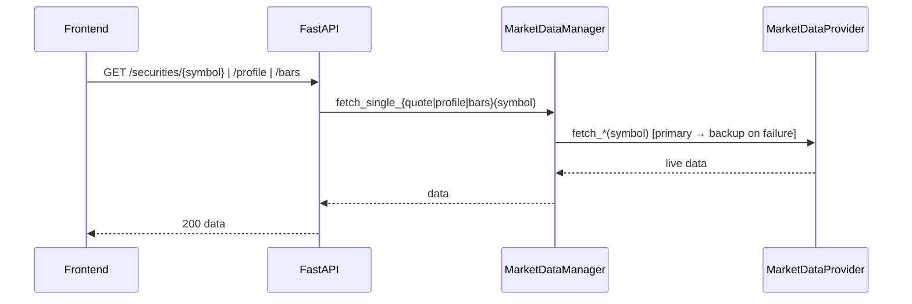
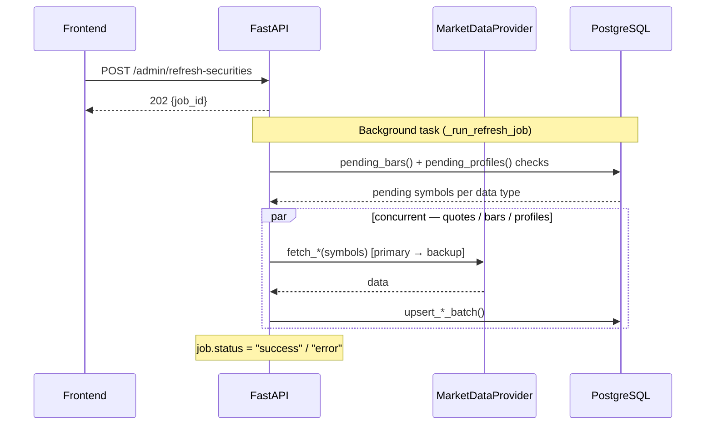
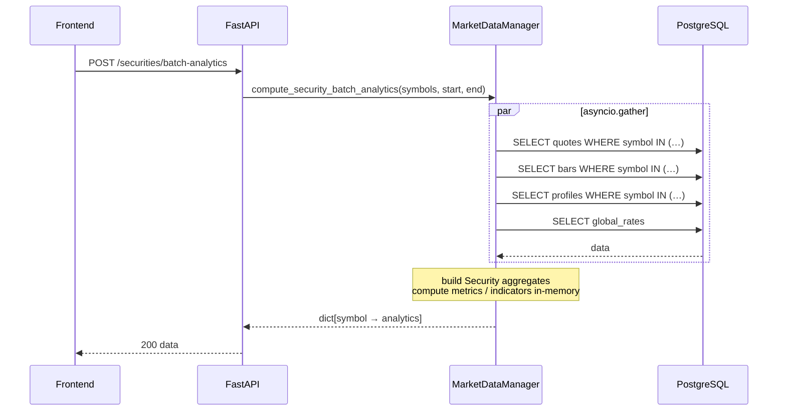

# Portfolio Tuner — Architecture & Engineering Design

## Table of Contents

1. [System Motivation](#1-system-motivation)
2. [High-Level System Design](#2-high-level-system-design)
3. [Domain Model](#3-domain-model)
4. [Application Layer](#4-application-layer)
5. [Ports and Adapters](#5-ports-and-adapters)
6. [Backend — FastAPI](#6-backend--fastapi)
7. [Frontend — Streamlit](#7-frontend--streamlit)
8. [Database Schema](#8-database-schema)
9. [Authentication and Multi-User Isolation](#9-authentication-and-multi-user-isolation)
10. [Market Data Integration](#10-market-data-integration)
11. [Analytics Engine](#11-analytics-engine)
12. [Background Job System](#12-background-job-system)
13. [Portfolio Simulation](#13-portfolio-simulation)
14. [Performance Engineering](#14-performance-engineering)
15. [Deployment](#15-deployment)
16. [Engineering Principles](#16-engineering-principles)
17. [Future Directions](#17-future-directions)

---

## 1. System Motivation

The core insight behind Portfolio Tuner is that the ledger — the raw record of every financial event in an account — is the single source of truth. Current holdings are derived from that ledger, not the other way around.

Most retail portfolio apps let you enter or sync your current holdings and then show you a live valuation. This works for a simple view of *what you hold now*, but falls apart when you want to understand *what happened over time*: how did cash flow through the account, what did you realise on a trade you closed a year ago, what is your true cost basis after splits and dividends, and what is your portfolio's actual rate of return relative to the capital you put in at different points in time?

Portfolio Tuner is built to answer those questions. It imports a broker ledger export (an `.xlsx` file) and reconstructs complete account state from scratch on every request. Every open position, every cash balance, every realised gain, every dividend received — all of it is derived from the transaction log, not stored as a separate snapshot. Market data is fetched and cached separately and then combined with the reconstructed account state to produce a current valuation.

This design means the system is always internally consistent: add a transaction and every downstream metric recomputes correctly. It also means the system is auditable — every number traces back to a raw event.

---

## 2. High-Level System Design

Portfolio Tuner is a two-service system:

```
┌──────────────────────────────────────────────────────────────┐
│  Streamlit Frontend  (port 8501)                             │
│  Multi-page dashboard — authentication, rendering, jobs      │
└────────────────────────┬─────────────────────────────────────┘
                         │ REST (JSON, JWT Bearer)
                         │ (no external cache layer)
┌────────────────────────▼─────────────────────────────────────┐
│  FastAPI Backend  (port 8000)                                │
│  Domain logic, analytics, market data, account management    │
│                                                              │
│  ┌──────────────┐  ┌───────────────┐  ┌──────────────────┐   │
│  │  /accounts   │  │  /securities  │  │  /admin + /jobs  │   │
│  └──────┬───────┘  └───────┬───────┘  └────────┬─────────┘   │
│         │                  │                    │            │
│  ┌──────▼──────────────────▼────────────────────▼─────────┐  │
│  │  Application (use cases)                               │  │
│  │  AccountManager │ MarketDataManager │ PortfolioManager │  │
│  └──────────────────────────────┬─────────────────────────┘  │
│                                 │                            │
│  ┌──────────────────────────────▼──────────────────────────┐ │
│  │  Domain (entities, aggregates, analytics)               │ │
│  └─────────────────────────────────────────────────────────┘ │
│                                 │                            │
│  ┌──────────────────────────────▼──────────────────────────┐ │
│  │  Infrastructure                                         │ │
│  │  FMPClient │ YFinanceClient │ ExcelPandasClient │ Repos │ │
│  └─────────────────────────────────────────────────────────┘ │
└──────────────────────────────────────────────────────────────┘
                         │ SQL (SQLAlchemy + psycopg2)
┌────────────────────────▼─────────────────────────────────────┐
│  Supabase PostgreSQL                                         │
│  Row-Level Security — user-scoped isolation                  │
└──────────────────────────────────────────────────────────────┘
                         │ Auth (JWT validation)
┌────────────────────────▼─────────────────────────────────────┐
│  Supabase Auth                                               │
│  ES256 asymmetric JWT signing                                │
└──────────────────────────────────────────────────────────────┘
```

Both services are Docker containers orchestrated by `docker-compose`. The frontend waits for the backend health check before starting, and communicates with the backend exclusively over REST. The backend manages all database access and all market data fetching.

---

## 3. Domain Model

The domain was designed first, before any infrastructure or UI decisions were made. The goal was to model financial concepts accurately and make the business logic portable and testable.

### Transaction

A `Transaction` is the atomic unit of the ledger. It represents a single financial event:

- **Trade events** — `Buy`, `Purchase`, `Sell`, `Sold`
- **Corporate actions** — `Split`, `Disburse`, `Exchange`
- **Options events** — `Expired` (options expiry)
- **Fixed-income events** — `Redeemed`
- **Cash events** — `Contrib`, `EFT`, `Transfer`, `Transf In`, `Withdrawal`
- **Income events** — `Dividend`, `Interest`
- **Expense events** — `Tax`, `HST`, `Fee`

Each transaction has a kind, date, symbol (optional), quantity, price, amount, currency, commission, exchange rate, and fees. The `QTY_EFFECT` mapping defines whether a given transaction kind increases, decreases, or leaves position size unchanged — this drives the portfolio reconstruction logic.

Transactions are persisted in the `transactions` table and can be entered manually via the dashboard or bulk-imported from an Excel ledger export.

### Account

An `AccountEntity` represents a brokerage account. It is a thin record — number, type (RRSP, TFSA, Non-Registered, etc.), currency, tax status, benchmark ticker, and the UUID of the owning user. The account itself holds no computed state; all derived values are re-computed from transactions at query time.

The `AccountManager` use case builds a richer in-memory account representation (`Account` aggregate) by replaying all transactions. From the transaction log it derives:

- **Open positions** — symbols with a net positive quantity after all buys and sells
- **Open lots** — per-lot cost basis (ACB), quantity, open date, and category (equity, call option, put option, fixed income)
- **Cash balance** — running sum of all cash movements
- **External cash flows** — deposits and withdrawals, used for MWRR calculation
- **Closed lots** — positions that have been fully sold or expired
- **Realised gains** — P&L on closed positions
- **Income and expense records** — dividends, interest, fees

### Security

A `Security` aggregate combines everything known about a market instrument:

- **Quote** — current price data (open, high, low, close, change, volume, timestamp)
- **Profile** — static metadata (name, exchange, currency, sector, industry,  market cap, year-high/low)
- **Bars** — OHLCV history as a list of daily records
- **Indicators** — computed timeseries (normalised close, daily return, and other derived series)
- **Metrics** — scalar performance statistics (total return, annualised volatility, Sharpe ratio, max drawdown, Sortino ratio)

A `Security` object is always constructed from cached database records, never directly from a live API call at request time. Market data is fetched and persisted in the background, then read at query time.

### Portfolio

The `Portfolio` aggregate is the central composite object. It is built on-demand from an account's open positions and a map of securities:

1. For each open position, find the corresponding `Security` and compute the current market value, unrealized gain, breakeven price, intraday P&L, weight, and contribution metrics.
2. Compute aggregate portfolio-level statistics: total book value, total market value, total value (market + cash), unrealized gain, return on cost, intraday P&L.
3. Compute portfolio-level timeseries indicators by taking a weighted combination of each security's bar series.
4. Compute portfolio-level performance metrics from those indicators.
5. Build a pairwise correlation matrix from each security's return series.
6. Compute the MWRR (Money Weighted Rate of Return, implemented as an IRR using Newton's method) from the account's external cash flows and current total value.

Options positions (calls and puts) are handled separately from equities. Intrinsic value is used as the current option value (market option pricing data is not yet implemented from the configured providers), and expired options are flagged with a zero value.

---

## 4. Application Layer

The application layer contains the business use cases. It has no knowledge of HTTP, databases, or external APIs — those are injected through port interfaces at startup.

### AccountManager (`application/use_cases/account.py`)

Responsible for all account-related operations:

- **CRUD** — create, read, patch, delete accounts
- **Transaction management** — create, read, delete individual transactions
- **Excel import** — parse an uploaded `.xlsx` ledger and upsert transactions
- **Account reconstruction** — replay transactions to produce the in-memory `Account` aggregate with open positions, cash balance, and cash flows
- **Records retrieval** — return transactions, closed lots, and cash flows in a single response object

### MarketDataManager (`application/use_cases/market_data.py`)

Responsible for market data operations:

- **Passthrough queries** — fetch a live quote, bars, or profile directly from the primary data source
- **Cached reads** — read quotes, bars, profiles from the database
- **Batch reads** — efficiently read data for multiple symbols
- **Analytics computation** — compute metrics and indicators for a symbol or batch of symbols
- **Async refresh** — fetch quotes, profiles, and bars for a list of symbols from the provider and upsert into the database; respects sync state to avoid redundant fetches; supports a `force` flag to re-fetch unconditionally
- **Global rates** — read and refresh the risk-free rate and CAD/USD exchange rate

### PortfolioManager (`application/use_cases/portfolio.py`)

Orchestrates `AccountManager` and `MarketDataManager` to produce the full portfolio view:

- **`build_portfolio_from_account`** — fetches account state and rates concurrently (using `asyncio.gather`), then fetches security data for all open positions asynchronously, and assembles a `Portfolio` object.
- **`get_portfolio`** — wraps the above and serialises the result into `PortfolioSnapshotDTO` for the API response.
- **`run_simulated_portfolio`** — fetches securities for a given symbol list and runs the `PortfolioSimulator`.

---

## 5. Ports and Adapters

The system follows the Hexagonal Architecture (Ports and Adapters) pattern. The domain and application layers define abstract interfaces (ports); the infrastructure layer provides concrete implementations (adapters).

### Ports (abstract interfaces)

**`MarketDataProvider`** — defines the contract any market data source must satisfy: `fetch_quote`, `fetch_bars`, `fetch_stock_profile`, `fetch_global_rates`. Both FMPClient and YFinanceClient implement this interface.

**`MarketDataRepository`** — defines the contract for reading and writing cached market data: quotes, bars, bars sync state, profiles, global rates, and symbol availability checks.

**`AccountDataRepository`** — defines the contract for account and transaction persistence: all account and transaction CRUD operations.

**`AccountDataImporter`** — defines the contract for parsing raw broker exports into `Transaction` objects: `import_records(file_bytes)`.

### Adapters (concrete implementations)

**`FMPClient`** (`infra/adapters/fmp_client.py`) — calls the Financial Modeling Prep REST API. It normalises the response into domain entities and handles rate limiting internally. Used as the primary data source when `ENABLE_FMP_AS_PRIMARY=true`.

**`YFinanceClient`** (`infra/adapters/yfinance_client.py`) — wraps the `yfinance` library. Used as the primary source when FMP is not enabled, or as a backup when FMP is the primary but fails.

**`ExcelPandasClient`** (`infra/adapters/excel_pandas_client.py`) — uses `pandas` to read an `.xlsx` broker export and parse it into `Transaction` domain objects. This is the bridge between raw broker data and the system's ledger model.

**`RateLimiter`** (`infra/adapters/rate_limiter.py`) — implements a thread-safe sliding-window algorithm to throttle outbound API calls. It tracks request timestamps in a deque and blocks until the oldest request ages out of the 60-second window. A separate `_backoff_until` timestamp is set on 429 responses; `acquire_slot()` will sleep through any active backoff period before checking the window. The backoff formula is `max(retry_after, 2) * min(2^attempt, 8)` seconds. The retry loop itself (up to 3 attempts by default) lives in `FMPClient._get()`.

**`PgMarketDataRepository` / `PgAccountDataRepository`** (`infra/db/repo.py`) — SQLAlchemy-based implementations of the repository ports, backed by Supabase PostgreSQL.

This architecture means the market data provider can be swapped (e.g., replacing FMP with another provider) without touching any domain or application code.

---

## 6. Backend — FastAPI

### Application Lifespan

The FastAPI application uses a lifespan context manager (`app.py`) to initialise shared, long-lived state at startup:

- A SQLAlchemy connection pool (`pool_size=5`, `max_overflow=10`, `pool_pre_ping=True`)
- The `ExcelPandasClient` instance
- The primary and backup market data provider instances (determined by `ENABLE_FMP_AS_PRIMARY`)

These are stored on `app.state` and injected into request handlers via FastAPI's dependency injection system.

### API Versioning and Routers

All routes are mounted under the `/api/v1` prefix. There are three routers:

**`/api/v1/accounts`** — account and portfolio management:
- `POST /accounts` — create a new account
- `GET /accounts` — list all accounts for the authenticated user
- `GET /accounts/{id}` — get account details
- `PATCH /accounts/{id}` — update account fields
- `DELETE /accounts/{id}` — delete account and all associated data (cascade)
- `GET /accounts/{id}/transactions` — list transactions
- `POST /accounts/{id}/transactions` — add a transaction
- `DELETE /accounts/{id}/transactions/{tx_id}` — delete a transaction
- `GET /accounts/{id}/records` — get transactions, open positions (open lots), closed lots, and cash flows in one call (`AccountRecordsDTO`)
- `GET /accounts/{id}/portfolio` — get the full portfolio snapshot (summary, holdings, metrics, indicators, correlation matrix, per-security analytics)

**`/api/v1/securities`** — market data access:
- `GET /securities` — list all symbols with cached data
- `POST /securities/availability` — check which of a set of symbols are missing from cache
- `GET /securities/{symbol}` — get a live quote
- `GET /securities/{symbol}/profile` — get a company profile
- `GET /securities/{symbol}/bars` — get OHLCV bars (with optional date range)
- `GET /securities/{symbol}/metrics` — compute performance metrics
- `GET /securities/{symbol}/indicators` — compute timeseries indicators
- `POST /securities/batch-quotes` — batch quotes
- `POST /securities/batch-profiles` — batch profiles
- `POST /securities/batch-bars` — batch bars
- `POST /securities/batch-metrics` — batch metrics (async)
- `POST /securities/batch-indicators` — batch indicators (async)
- `POST /securities/batch-analytics` — full analytics bundle (quote + profile + bars + metrics + indicators) for multiple symbols in one call (async)

**`/api/v1/admin`** — administrative operations:
- `GET /rates` — get current global rates (risk-free rate, CAD/USD FX)
- `POST /admin/import-account` — import a broker Excel file for an account
- `POST /admin/refresh-rates` — refresh global rates from the market data provider
- `POST /admin/refresh-securities` — trigger a background refresh job for a list of symbols
- `GET /jobs/{job_id}` — poll background job status and progress

**`/health`** — health check endpoint for Docker health monitoring.

### Dependency Injection

FastAPI's `Depends` system is used consistently throughout. Each request handler receives fully constructed `AccountManager`, `MarketDataManager`, or `PortfolioManager` instances through dependency functions that read from `app.state` and construct the appropriate repositories and managers. This keeps routers thin and the application layer decoupled from infrastructure.

### Authentication Enforcement

All routes (except `/health`) require a valid `Authorization: Bearer <jwt>` header, enforced via the `verify_token` dependency. Token verification uses the Supabase JWT public key (ES256/P-256) to validate signature and expiry without any network round-trip. The `get_current_user_id` dependency extracts the user UUID from the validated token and passes it to endpoint handlers that need to associate data with a specific user (e.g., account creation).

---

## 7. Frontend — Streamlit

### Application Structure

The frontend is a Streamlit multi-page application. `app.py` is the entry point and acts as the shell:

- Handles authentication (login form, session token management, token refresh)
- Shows the disclaimer dialog on first load
- Builds the sidebar (account selection, benchmark selection, account management buttons, refresh controls, logout)
- Bootstraps session state (stable defaults, symbols config, date range defaults) exactly once per session via a versioned `BOOT_VERSION` guard
- Runs the selected page via `st.navigation`

**Pages:**

- **`1_Market_ETFs.py`** — ETF research dashboard: market snapshot strip, movers table, performance tab, intraday chart. Symbols driven by `symbols.yml`.
- **`2_Market_Stocks.py`** — Stock research dashboard: same structure as the ETF page but for the stock symbol groups.
- **`3_Portfolios.py`** — Main portfolio dashboard: account summary KPIs, market snapshot strip, holdings positions table (with sparklines), performance tab, allocation chart, correlation matrix, and transaction records/reports.
- **`9_About.py`** — Legal disclaimer and project information.

### Session State Management

Streamlit reruns the entire script on every user interaction. A versioned `bootstrap_once()` function runs at app startup and writes all stable defaults to `st.session_state` exactly once per session. This prevents expensive initialisation from running on every rerun.

Each page reads its required state from `st.session_state` at the top, and fails fast with an informative error if keys are missing (e.g., due to a browser refresh mid-session).

The sidebar always runs before any page renders, establishing the selected account, benchmark, and other controls that all pages depend on.

### Symbols Configuration

Symbol sets for the market research pages, benchmarks, and the market snapshot header are configured in `src/frontend/shared/symbols.yml`. The config loader (`shared/config_loader.py`) parses this YAML file into a validated `SymbolsConfig` Pydantic model. The bootstrap phase reads this file once and stores the derived symbol sets in session state. Changing symbols only requires editing the YAML file — no code changes. The YAML supports symbol groups with labels (e.g., "Magnificent 7", "TSX 60", "US Sectors") that are used to organise the display in the market research pages.

### Data Flow

Each page follows the same pattern:

1. Read required state from `st.session_state`
2. Determine which symbols are needed for this page
3. Check symbol availability (via `POST /securities/availability`)
4. If symbols are missing, automatically start a blocking refresh job and wait
5. Load cached data from the backend (quotes, bars, analytics) using `@st.cache_data`-decorated functions in `services/streamlit_data.py`
6. Reshape data into dataframes using helpers in `shared/dataframe.py`
7. Render widgets

### API Client and Data Loading

`services/api_client.py` is a thin wrapper over `requests` that handles the JWT Bearer token header, base URL construction, and basic error handling. It is instantiated once per session and stored in session state.

`services/streamlit_data.py` wraps every backend call with `@st.cache_data` (with a short TTL, driven by the auto-refresh interval). This ensures that multiple widgets on the same page that need the same data don't trigger redundant API calls, and that data is refreshed automatically when the auto-refresh timer fires.

### Widget Library

All rendering logic lives in the `widgets/` directory, with one module per UI concept:

| Widget module | Responsibility |
|---|---|
| `kpis.py` | Account summary metrics, market snapshot strip, status strip (rates, FX, last data timestamps) |
| `positions.py` | Holdings table with sparklines, gain/loss colouring, FX exposure, options info |
| `performance.py` | Multi-tab performance view with signal options and analytics table |
| `allocation.py` | Portfolio allocation chart (treemap or pie) |
| `correlation.py` | Correlation matrix heatmap |
| `growth_chart.py` | Normalised growth chart |
| `risk_chart.py` | Risk/return scatter chart |
| `movers.py` | Top movers table grouped by category |
| `intraday.py` | Intraday price chart |
| `reports.py` | Transactions table, closed lots table, cash flows table |
| `treemaps.py` | Treemap visualisations |
| `account_dialogs.py` | Create/edit account dialogs |
| `transaction_form.py` | Manual transaction entry dialog |

### Background Job UI

When a market data refresh is triggered, the frontend calls `POST /admin/refresh-securities`, receives a job ID, and then polls `GET /jobs/{job_id}` on every Streamlit rerun (driven by `streamlit_autorefresh`) until the job completes. `shared/jobs.py` manages this state in `st.session_state` and renders a progress banner. Blocking jobs (triggered automatically when symbols are missing) hold the page until completion; non-blocking jobs (triggered manually) allow the rest of the page to render while the job runs.

---

## 8. Database Schema

The database is hosted on Supabase (Postgres). SQLAlchemy is used as the ORM with explicit model classes. Row-Level Security is enforced at the Postgres level.

| Table | Purpose |
|---|---|
| `accounts` | Brokerage accounts. `owner` is the Supabase user UUID; RLS policies restrict reads and writes to the owning user. |
| `transactions` | Transaction records. FK to `accounts(id)` with `ON DELETE CASCADE`. Indexed on `account_number`. |
| `quotes` | Latest quote snapshot per symbol (OHLCV, change, timestamp). One row per symbol, overwritten on refresh. |
| `bars` | Daily OHLCV history. Composite primary key `(symbol, date)`. Composite index on `(symbol, date)`. |
| `bars_sync_state` | Tracks the last successful bar fetch per symbol (`last_bar_date`, `last_checked_at`, status). Used for smart sync. |
| `profiles` | Company profile data (sector, industry, beta, market cap, etc.). One row per symbol. |
| `global_rates` | Current risk-free rate and CAD/USD FX rate. Single row, updated on refresh. |

The `bars_sync_state` table is particularly important for efficiency. Before fetching bars for a symbol, the system checks whether it has a recent successful sync. If so, it only fetches bars newer than `last_bar_date`, avoiding re-downloading redundant history on every refresh. The `force=True` flag bypasses this and re-fetches the full requested range.

Market data tables (quotes, bars, profiles, global_rates) are not user-scoped — they are shared across all users. Only `accounts` and `transactions` are user-scoped with RLS.

---

## 9. Authentication and Multi-User Isolation

### Authentication Flow

1. The user enters credentials in the Streamlit login form.
2. The frontend calls Supabase Auth's `sign_in_with_password` directly (using the `supabase-py` client with the project's anon key).
3. Supabase returns a session containing a JWT access token.
4. The JWT is stored in `st.session_state["jwt_token"]`.
5. Every subsequent backend API call includes `Authorization: Bearer <jwt>` in the request header.
6. The backend's `verify_token` dependency validates the JWT signature using the Supabase ECDSA public key (ES256/P-256) — no network call required. The token is rejected if invalid or expired.
7. On each Streamlit rerun, the frontend calls `supabase.auth.get_session()` to pick up rotated tokens. If the session has fully expired, session state is cleared and the user is redirected to the login screen.

### Row-Level Security

User isolation is enforced at two layers:

1. **Application layer** — the `owner` field on every account is set to the authenticated user's UUID at creation time. The backend never returns accounts for a different user, because the RLS policies prevent it.
2. **Database layer** — Supabase RLS policies on the `accounts` table ensure that a database connection configured with a given user's identity can only see rows where `owner = auth.uid()`. The backend propagates user identity into the database session, so even a bug in application logic cannot leak another user's accounts.

Transactions inherit user isolation transitively through their FK relationship to accounts.

### Database Session and RLS Enforcement

The backend maintains a single SQLAlchemy connection pool connected as the Postgres superuser. Two session factories are used depending on the calling endpoint (`infra/api/v1/dependencies/db.py`):

- **`get_user_db`** (user-scoped endpoints — accounts, portfolio, securities reads) — immediately executes `SET LOCAL ROLE authenticated` and `SELECT set_config('request.jwt.claim.sub', <user_id>, true)` within the transaction. This switches the effective Postgres role and populates the `auth.uid()` claim so that Supabase RLS policies apply correctly for the duration of the request. Market data tables (`quotes`, `bars`, `profiles`, `global_rates`) are shared across all users and have no RLS policies; only `accounts` and `transactions` are affected.

- **`get_admin_db`** (admin and background job endpoints) — uses the superuser connection directly. RLS is bypassed entirely. Isolation for these endpoints is enforced at the application layer by the `verify_token` dependency — not at the database layer.

---

## 10. Market Data Integration

### Provider Architecture

The system supports a primary and an optional backup market data provider, both implementing the `MarketDataProvider` port:

- **Financial Modeling Prep (FMP)** — a paid API with comprehensive coverage (US, TSX, indices, commodities, crypto ETFs). Configured with an API key and a per-minute rate limit. Used as primary when `ENABLE_FMP_AS_PRIMARY=true`.
- **yfinance** — a free library wrapping Yahoo Finance. Useful for development and as a fallback. Used as primary (with no backup) when FMP is not enabled.

When `ENABLE_FMP_AS_PRIMARY=true`, yfinance is registered as the backup. If the primary provider fails to return data for a symbol, the backup is attempted automatically.

### Data Fetching and Caching

Market data is fetched asynchronously in batches during refresh operations and stored in the database. At query time, data is always read from the database — never fetched live on the critical request path (except for explicit passthrough endpoints). This keeps API response times predictable and decouples valuation from external API availability.

Refresh operations follow a two-phase pattern:

1. **Pending determination** — `pending_quotes()`, `pending_bars()`, and `pending_profiles()` inspect the current database state and return only the work items that actually need fetching (e.g., symbols with no cached profile, or bar ranges not yet stored). `pending_bars()` leverages `BarsSyncState` to return per-symbol `(symbol, fetch_start, fetch_end)` tuples, requesting only the missing date range. The `force=True` flag bypasses this check and re-fetches the full requested range.
2. **Async execution** — `refresh_quotes_async()`, `refresh_bars_async()`, and `refresh_profiles_async()` accept the pending work lists produced above and execute the fetches concurrently, upserting results into the database as each symbol completes.

Each fetch uses a two-tier fallback: the primary provider is attempted first; if it returns no data, the backup provider is tried. Both tiers returning nothing results in a silent skip for that symbol rather than an exception, so a single unavailable symbol does not abort the entire refresh job.

### Data Flow Patterns

Market data endpoints fall into one of three patterns depending on whether data is served live from the external provider, written to the database as part of a background refresh, or read directly from the database.

**1. Direct Fetchers** — Three endpoints bypass the database entirely and contact the external provider on every call, returning data synchronously to the frontend. These are the passthrough endpoints used for one-off live lookups.

| Endpoint | Data returned |
|---|---|
| `GET /securities/{symbol}` | Live quote |
| `GET /securities/{symbol}/profile` | Company profile |
| `GET /securities/{symbol}/bars` | OHLCV bar history |



**2. Refresh Paths** — Two endpoints fetch from the external provider and write results to the database. The response to the frontend is only an acknowledgment (`202 Accepted`, plus a `job_id` for the async securities refresh); no market data flows back to the caller. The securities refresh runs as a background task after the HTTP response is sent, executing pending quote, bar, and profile fetches concurrently.

| Endpoint | Behaviour |
|---|---|
| `POST /admin/refresh-rates` | Synchronous — fetches global rates and upserts to DB; returns 202 |
| `POST /admin/refresh-securities` | Async — returns `job_id` immediately; background job writes to DB |
| `GET /jobs/{job_id}` | Polls in-memory job registry; no DB or market data contact |



**3. DB-Only Reads** — All remaining market data endpoints read exclusively from the database; no external API is contacted. Simple lookups (`GET /rates`, `GET /securities`, `POST /securities/availability`, `POST /securities/batch-{quotes,profiles,bars}`) issue a single SQL query and return results directly. The compute endpoints (`POST /securities/batch-{metrics,indicators,analytics}`) run four database reads concurrently via `asyncio.gather` and build metrics and indicators in-memory.

> **Note:** `GET /rates` falls back to the external provider if the `global_rates` table is empty, but does not write to the database.



### Rate Limiting

The `RateLimiter` adapter uses a thread-safe sliding-window algorithm: it tracks request timestamps in a deque and blocks until the oldest request ages out of the 60-second window. On HTTP 429 responses, the `FMPClient` calls `handle_rate_limit(retry_after, attempt)`, which sets a backoff period of `max(retry_after, 2) * min(2^attempt, 8)` seconds; any subsequent `acquire_slot()` call sleeps through this period before checking the window. `FMPClient` retries up to 3 times before giving up. API keys are redacted from all log output and error messages.

---

## 11. Analytics Engine

Analytics are computed in the domain layer (`domain/analytics/`) from raw OHLCV bar data. All analytics are pure functions of the input data — no side effects, no database access.

Before computing indicators and metrics, the current live quote is appended to the historical bar series as the latest data point. This ensures all analytics reflect the current trading day's price even before the official end-of-day bar has been persisted by the refresh job. If a bar for today's date already exists in the database, the live quote replaces it in the in-memory series rather than appending a duplicate point.

### Per-Security Analytics

`compute_performance_metrics(indicators_df, rf_rate)` takes a timeseries of daily indicators for a security and populates a `PerformanceMetric` object with:

- **Period returns** — `return5D`, `return1M`, `return3M`, `return6M`, `return1Y`
- **Annualised volatility** — standard deviation of log returns, annualised
- **Sharpe ratio** — excess return over risk-free rate divided by volatility
- **Sortino ratio** — excess return divided by downside deviation
- **Max drawdown** — maximum peak-to-trough decline, with the date it occurred
- **RSI slope** — recent directional momentum of RSI
- **52-week proximity flags** — `near_52wk_hi` and `near_52wk_lo` boolean signals

`compute_portfolio_timeseries_indicators(securities, weights)` combines the bar series of multiple securities using a weight vector to produce a weighted portfolio timeseries. It handles a weight *matrix* (used in simulation) and returns one `DataFrame` per row of the weight matrix.

`compute_correlation_matrix(securities)` extracts the daily returns from each security's bar series, aligns them on a shared date index, and computes the Pearson correlation matrix. The result is serialised as a flat list of `(row, col, value)` entries for efficient JSON transport.

### Portfolio-Level Analytics

The `Portfolio.build()` method orchestrates the analytics pipeline in the correct order:

1. `_build_holdings()` — compute market values, gains, weights, and contributions per position
2. `_build_indicators()` — compute the weighted portfolio timeseries
3. `_build_metrics()` — compute portfolio-level performance metrics from the timeseries
4. `_build_correlation_matrix()` — compute pairwise return correlations across holdings

### MWRR (Money Weighted Rate of Return)

The portfolio-level MWRR is computed as an IRR (Internal Rate of Return) on the account's external cash flows. The implementation uses Newton's method with up to 100 iterations and a convergence tolerance of 1e-10. External cash flows are the deposits and withdrawals to/from the account; the terminal cash outflow is the current total portfolio value (as if the portfolio were liquidated today). The IRR of this cash flow series is the annualised rate of return that accounts for the timing and size of all capital movements — a more honest measure of performance than simple return on current cost.

---

## 12. Background Job System

Large market data refresh operations (e.g., refreshing 200+ symbols with full bar history) can take tens of seconds. Running these synchronously would either time out HTTP requests or block the backend for other users.

The backend uses FastAPI's `BackgroundTasks` to schedule refresh work after the HTTP response is sent. The flow:

1. The frontend calls `POST /admin/refresh-securities` with a list of symbols and optional date range.
2. A `RefreshJob` object is created, stored in an in-memory registry (`_JOBS` dict), and assigned a UUID.
3. `_run_refresh_job` is scheduled as a background task. The HTTP response returns immediately with the job ID.
4. The background task first calls `pending_quotes()`, `pending_bars()`, and `pending_profiles()` to determine exactly which fetch operations are needed across all data types. The sum of these becomes `job.work_total`. It then executes the refresh in order: global rates → quotes → bars → profiles, decrementing `job.work_remaining` via an `on_progress()` callback after each symbol is processed.
5. The frontend polls `GET /jobs/{job_id}` (driven by `streamlit_autorefresh`) to track progress and display a progress bar (`work_completed = work_total - work_remaining`).
6. When the job finishes (success or error), the frontend clears job state, invalidates its data cache, and reruns.

A cooldown timer (`_LAST_REFRESH`, 3 seconds) prevents the endpoint from being hammered with duplicate requests.

This in-memory job store is simple and sufficient for a single-instance deployment. It does not survive backend restarts and is not visible across multiple backend replicas. Additionally, background tasks run in the same process as request handlers — a large refresh competes for CPU and memory with concurrent API requests.

---

## 13. Portfolio Simulation

The `PortfolioSimulator` (`domain/aggregates/portfolio_simulator.py`) implements a Monte Carlo approach to portfolio optimisation:

1. Generate `n_p` random weight vectors for the given symbol set using a Dirichlet distribution. This produces uniformly distributed points on the simplex (all weights positive, sum to 1).
2. For each weight vector, compute the weighted portfolio timeseries using `compute_portfolio_timeseries_indicators`.
3. Compute performance metrics (Sharpe, volatility, return) for each simulated portfolio.
4. Find the portfolio with the highest Sharpe ratio and return its metrics and weights as the "optimal" allocation.

The simulator is called from `PortfolioManager.run_simulated_portfolio` and surfaced in the frontend's allocation widget as an alternative to the current holdings allocation.

The current default of `n_p=5000` provides a reasonable approximation of the efficient frontier for small symbol sets. The approach is straightforward but not vectorised across portfolios; performance scales linearly with the number of securities and portfolios simulated.

---

## 14. Performance Engineering

### Async Concurrency

The backend uses `asyncio` for operations that involve many independent I/O calls. The primary example is `MarketDataManager.refresh_securities_async`, which fetches quotes, profiles, and bars for each symbol independently. A semaphore bounds the number of concurrent in-flight requests to `MAX_CONCURRENCY` (default: 5), preventing resource exhaustion against the external API.

Synchronous library calls (e.g., `yfinance`, `pandas` Excel parsing) are offloaded to a thread pool using `asyncio.to_thread`, keeping the event loop free.

### Connection Pooling

The SQLAlchemy engine is configured with `pool_size=5` and `max_overflow=10`. `pool_pre_ping=True` detects stale connections before use, preventing errors from idle-timeout disconnections.

### Frontend Caching

Streamlit's `@st.cache_data` decorator is used on all backend-calling functions in `services/streamlit_data.py`. Data is cached keyed by function arguments (account ID, date range, symbol list), so multiple widgets referencing the same data on a single page render only trigger one API call. The cache is invalidated explicitly after import, account create/delete, and transaction operations.

---

## 15. Deployment

### Docker Compose

```yaml
services:
  backend:
    build: ./src/backend/Dockerfile
    ports: ["8000:8000"]
    env_file: .env
    healthcheck: GET /health  # every 15s
    restart: unless-stopped

  frontend:
    build: ./src/frontend/Dockerfile
    ports: ["8501:8501"]
    env_file: .env
    environment:
      BACKEND_URL: http://backend:8000
    depends_on:
      backend: {condition: service_healthy}
    restart: unless-stopped
```

The frontend container does not start until the backend passes its health check. Inside the Docker network, the frontend reaches the backend at `http://backend:8000` (Docker service DNS). On the host, the backend is also accessible at `http://localhost:8000/docs` for direct API exploration via the OpenAPI UI.

### Package Management

The project uses `uv` as the package manager with a workspace layout: the root `pyproject.toml` declares both `src/backend` and `src/frontend` as workspace members, each with their own `pyproject.toml`. This keeps frontend and backend dependencies cleanly separated while allowing a single `uv sync` from the root for local development.

### Configuration

All configuration is environment-variable-driven, loaded via Pydantic `BaseSettings`. The backend reads a shared `.env` file and ignores any frontend-specific variables. The frontend similarly reads the `.env` file but uses only its own subset. A single `.env` file serves both services without duplication.

---

## 16. Engineering Principles

**Single Responsibility** — each module and class has one reason to change. Routers do not contain business logic. Use cases do not know about HTTP or SQL. Domain objects do not know about persistence or rendering.

**Dependency Inversion** — the domain and application layers depend on abstract port interfaces, not on concrete adapters. This is enforced structurally: the domain package imports nothing from infra.

**Open/Closed** — adding a new market data provider means implementing the `MarketDataProvider` interface and registering it in the lifespan — no changes to any existing code.

**YAGNI** — the system implements only what is needed now. The background job system is intentionally simple (in-memory, single-replica) because that is sufficient for the current deployment model. Complexity is added when there is a concrete reason, not speculatively.

**Thin controllers** — API routers are kept as thin as possible. They validate inputs, delegate to use cases, and map exceptions to HTTP responses. Business logic does not leak into routers.

**AI-assisted engineering** — AI tools (Claude Code) were used as accelerators for implementation, exploration, and code review (Codex) — not as substitutes for design judgment or understanding. All architectural decisions and final integrations were human-driven and reviewed.

---

## 17. Future Directions
- **Persistent job system** — replace the in-process BackgroundTasks + in-memory job registry with a durable scheduler that supports recurring refreshes, survives restarts, and is visible across replicas
- **Repo read cache** — add a short-lived in-memory cache on the read paths for quotes, bars, and profiles so repeated reads within a request cycle or refresh window are served from memory, reducing DB round-trips and egress
- **OAuth providers** — extend Supabase Auth with Google, GitHub, or other OAuth providers for easier onboarding
- **Option pricing** — integrate a live options data feed to replace the current intrinsic-value approximation
- **Additional broker importers** — add adapters for other broker export formats beyond the current Excel importer
- **Portfolio narrative + insights** — use an LLM to generate plain-language summaries of portfolio performance, explain computed metrics (returns, drawdown, Sharpe) in the context of current holdings, and provide observations on broad market
