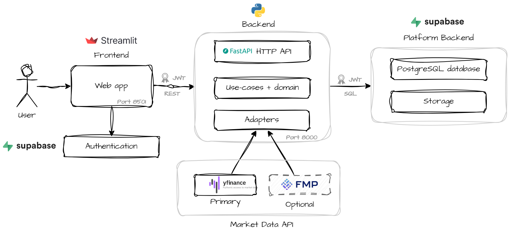

# Portfolio Tuner

A full-stack portfolio tracking and analytics platform that combines **broker transaction history** with **live market data** to produce an accurate, computation-driven view of portfolio performance.

Unlike typical portfolio apps that rely only on current holdings, Portfolio Tuner reconstructs portfolio state from raw transaction records — enabling precise performance analysis and cost-basis accounting.

The system unifies two authoritative data sources:

1. **Broker ledger (Excel import)** — buys/sells, deposits/withdrawals, dividends, fees, taxes, interest, option exercises, splits, closed positions, and realized P&L
2. **Live market data** — quotes, historical OHLCV bars, and security profiles from configurable providers

Together they produce a real-time, historically-grounded portfolio view.

---

## Architecture at a Glance



Both services run in Docker containers orchestrated by `docker-compose`. See [ARCHITECTURE.md](ARCHITECTURE.md) for the full technical design.

---

## Key Features

| Feature | Description |
|---|---|
| **Portfolio reconstruction** | Builds account state directly from raw transaction history — ACB tracking, open lots, cash flows |
| **Real-time valuation** | Combines ledger cost basis with live market quotes |
| **Performance metrics** | MWRR (IRR-based), Sharpe ratio, volatility, returns across any date range |
| **Technical indicators** | Timeseries indicators computed over historical OHLCV bars |
| **Correlation matrix** | Inter-security return correlation for holdings |
| **Portfolio simulation** | Monte Carlo simulation across random weight distributions; optimise for Sharpe, volatility, max drawdown, or 1Y return with an interactive efficient frontier chart |
| **Market research pages** | ETF and stock screener views with movers, performance tables, and intraday chart |
| **Transaction entry** | Manual transaction recording and broker Excel import |
| **Background refresh jobs** | Async market data updates with real-time progress tracking |
| **Multi-account support** | Switch between accounts; each user's data is isolated at the database level via RLS |
| **Options tracking** | Call and put positions tracked with intrinsic value, DTE, and breakeven |


---

## Running Locally

### Prerequisites

- [Docker Desktop](https://docs.docker.com/desktop/) (Windows/Mac/Linux)
- A [Supabase](https://supabase.com) project (PostgreSQL + Auth)
- *Optional* - [Financial Modeling Prep](https://site.financialmodelingprep.com/developer/docs/pricing) API key ([yfinance](https://github.com/ranaroussi/yfinance) will be used as primary if not provided)

### Database Setup (first run only)

Before starting the app for the first time, initialise the database schema in your Supabase project:

1. Open your [Supabase](https://supabase.com) project dashboard
2. Navigate to **SQL Editor** in the left sidebar
3. Copy the full contents of [`supabase/schema.sql`](supabase/schema.sql)
4. Paste into the editor and click **Run**

This creates all tables, indexes, foreign keys, RLS policies, and role grants required by the application. It is safe to re-run — all statements use `CREATE TABLE IF NOT EXISTS`.

### User Management

Portfolio Tuner does not include a user registration or admin UI. Users are managed entirely through Supabase:

- **First user:** Go to your Supabase project → **Authentication** → **Users** → **Add user** → **Create new user**
- **Additional users:** Same process — invite or manually create each user from the Supabase dashboard
- Users sign in to the Portfolio Tuner dashboard with the email/password set in Supabase

### Setup

```bash
git clone https://github.com/aerotrin/portfolio-tuner.git
cd portfolio-tuner
cp .env.example .env
# Fill in the required environment variables (see below)
cp symbols.example.yml symbols.yml
# (Optional) Customise symbols.yml (see instructions in file)
docker compose up --build
```

| Service | URL |
|---|---|
| Frontend dashboard | http://localhost:8501 |
| Backend API (OpenAPI docs) | http://localhost:8000/docs |

### Required Environment Variables

```env
# Database
POSTGRES_URL=postgresql://...

# Supabase Auth
SUPABASE_URL=https://<project>.supabase.co
SUPABASE_KEY=<anon-key>
SUPABASE_JWT_PUBLIC_KEY=<jwt-public-key>

# Market data (optional — yfinance used if FMP not enabled)
ENABLE_FMP_AS_PRIMARY=false
FMP_API_KEY=
FMP_RATE_LIMIT=100

```

### Symbols Configuration

The market research pages and benchmark lists are driven by `symbols.yml` in the project root. Edit this file to add or remove symbols, grouped by category. See `symbols.example.yml` for the full format and instructions.

---

## Project Structure

```
portfolio-tuner/
├── src/
│   ├── backend/                   # FastAPI application (uv package)
│   │   ├── domain/                # Entities, aggregates, analytics
│   │   ├── application/           # Use cases and port interfaces
│   │   ├── infra/                 # Adapters, API routers, DB models
│   │   └── shared/                # Config, logging
│   └── frontend/                  # Streamlit application (uv package)
│       ├── pages/                 # Multi-page app pages
│       ├── services/              # API client, cached data loaders
│       ├── shared/                # Config, dataframe helpers, job management
│       └── widgets/               # All UI rendering components
├── docs/                          # Additional documentation
├── docker-compose.yml
└── pyproject.toml                 # uv workspace root
```

---

## Documentation

- [ARCHITECTURE.md](ARCHITECTURE.md) — Full technical design and engineering rationale
- [docs/USER_GUIDE.md](docs/USER_GUIDE.md) — Dashboard user guide with user flow

---

## License

MIT License
